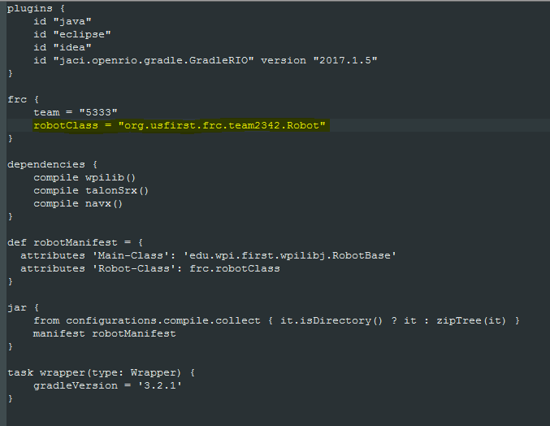

# Java Development Setup

In order to work on robotics code, there are a number of programs that need to be properly installed on your machine. These steps will guide you throught the process of setting up everything you need to in order to be ready to develop for the coding subteam in Java using IntelliJ IDEA.

## Git

Git is the [version control software](https://en.wikipedia.org/wiki/Version_control) used by Team Phoenix, and in order to push changes you make to our repositories, you will need to have it installed on your computer.

#### Windows

1. Grab the windows installer from [here](https://git-scm.com/download/win)

2. Open it, and go through the steps of installing with all of the default options

3. Ensure your line endings are properly configured by running this command in a terminal:

  ```bash
  git config --global core.autocrlf true
  ```

#### Mac OS X

1. Grab the Mac OS X installer from [here](https://git-scm.com/download/mac)

2. Open it, and go through the steps of installing with all of the default options

3. Ensure your line endings are prroperly configured by running this command in a terminal:

  ```bash
  git config --global core.autocrlf input
  ```

#### Linux

1. Open a command prompt
2. Use your favorite package manager to install Git. On Ubuntu, the command is this:
  
  ```bash
  sudo apt-get install git
  ```
  
3. After the installation finishes, make sure that your line endings are set up correctly by running this command:

  ```bash
  git config --global core.autocrlf input
  ```
  
## Java

In order to program in Java, your computer is required to have a JDK, or Java Development Kit. Your computer may already have Java installed, however to ensure that your Java version is updated we recommend that you follow these steps.

#### Windows

1. Download the latest Windows JDK for your CPU architecture from [here](http://www.oracle.com/technetwork/java/javase/downloads/jdk8-downloads-2133151.html)

2. Click on it and go through the steps of installing it, making note of the directory it installs to

3. Set your system PATH variable to include your Java installation:
  
  - Search for "environment variable" in the start menu and click on "Edit the system environment variables"
  - Click the "Environment Variables" button
  - On the top section of the new window, highlight `PATH` and hit "Edit"
  - Press the "New" button to create a new entry, and then enter the path to the `bin` folder inside of your Java installation. For Java 8 Update 64, this should be `C:\Program Files\Java\jdk1.8.0_74\bin`. However, yours may be slightly different.
  - Click "OK" on all of the settings windows to close them
  
#### Mac OS X

1. Download the latest Mac OS X JDK from [here](http://www.oracle.com/technetwork/java/javase/downloads/jdk8-downloads-2133151.html)

2. Double click on the file to launch it

3. A Finder window will appear containing an icon of an open box and the name of the .pkg file Double click the package icon to launch the Install app.

4. Go through the installation as you would for any other program
  
#### Ubuntu

1. Add the repository with prebuild Oracle Java installers and update your sources list:

  ```bash
  sudo add-apt-repository ppa:webupd8team/java
  sudo apt-get update
  ```
  
2. Install Java. Make sure to accept the license when prompted.

  ```bash
  sudo apt-get install oracle-java8-installer
  ```

3. Set up Java environment variables by installing this package:

  ```bash
  sudo apt-get install oracle-java8-set-default
  ```
  
## IntelliJ IDEA

Due to its many features and ease of use, we have decided to use IntelliJ IDEA as our IDE for writing Java code this year. These steps will guide you through the basic installation, which is similar regardless of your operating system.

1. Download the Community Edition of IntelliJ IDEA from [this site](https://www.jetbrains.com/idea/). This will automatically download the latest version for your operating system.

2. Open the executable and follow the installation process. It is recommended that you check the box for creating associations with .java files.

3. Once the installation completes, run the program and choose your personal settings such as UI theme. Do not disable any plugins when prompted.

## GradleRIO

In addition to a development enviroment for Java, in order to write code for FRC a system of deploying code to the RoboRIO is required. We achieve this using GradleRIO, a third-party Gradle plugin that automates the deployment process.

#### Windows

1. Create an empty project in IntelliJ using default settings. This will be your robot project.

2. Download Quickstart.zip from [this repository on GitHub](https://github.com/Open-RIO/GradleRIO).

3. Unzip the entire contents of this file to the directory for your project created by IntelliJ. This path can be found in IntelliJ's status bar.

4. Navigate to your project directory in Windows Explorer, and open the file build.gradle in a text editor of your choice. The contents of the file should look like: 

   

   This file should be up to date, excepting the default package. To fix this, simply change the number 0000 in the highlighted line to 2342.
   
5. After restarting IntelliJ, you should receive a prompt to import a Gradle project to your project. Click the hyperlink in this box and press OK. Wait for the import and downloads to finish, and your project is ready to be used for FRC code!

#TODO add sections for OSX and Linux, or generalize the Windows section if this isn't necessary

